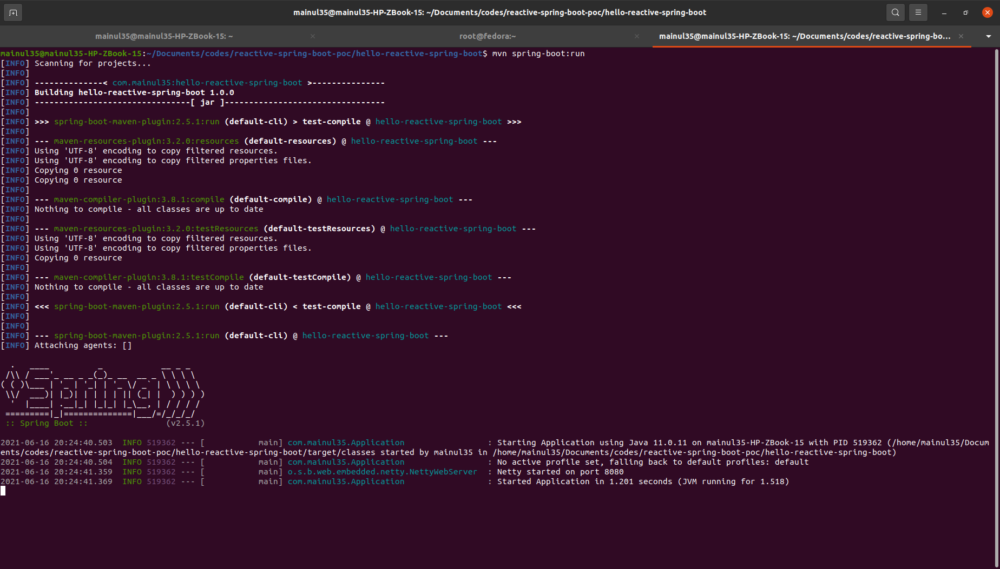

# Dependencies
The only dependency we need to make a simple reactive Spring Boot application is the ``spring-boot-starter-webflux``

```
	<dependency>
	    <groupId>org.springframework.boot</groupId>
	    <artifactId>spring-boot-starter-webflux</artifactId>
	</dependency>
```

# Maven Plugins
In the build section, add the ``spring-boot-maven-plugin`` plugin

```
<build>
    <plugins>
        <plugin>
            <groupId>org.springframework.boot</groupId>
            <artifactId>spring-boot-maven-plugin</artifactId>
        </plugin>
		<!-- Add more plugins if necessary -->
    </plugins>
</build>
```
# Application Entrypoint
According to convension of a Java program, we require a main class (a class containing main method is known as main class). In our case, we have named our main class as ``Application``. Note that out main class will be annotated with ``@SpringBootApplication`` annotation, so that Spring boot framework can identify this class as the entry point.
```
@SpringBootApplication
public class Application {

	public static void main(String[] args) {
		SpringApplication.run(Application.class, args);
	}
}
```
One more thing to mention, in the main method we will call the static ``run(...)`` method from the ``SpringApplication`` class. We do this thing as convension.

# Controller
We have a simple controller, which just receives a GET request and responds with a message. To identify the class as a controller class we need to annotate it with @RestController annotation. This controller class has currently only one method, ``hello()``, which will intercept the GET request on the base path. To make this work, we had to annotate the method with ``@GetMapping`` annotation. In return, we are responding with a message: **Hello world** in Mono. 

```
@RestController
public class HelloController {
	
	@GetMapping({"", "/"})
	public Mono<String> hello() {
        return Mono.just("Hello world.");
    }

}
```
# Run Application
If your system has already maven in class path, then open terminal / PowerShell inside your project folder and run the following maven command.

```
mvn spring-boot:run
```


You will see the application running on port 8080. However, if you are not familiar enough with terminal / PowerShell, then you can also run it from your favorite IDE. 


# Try with Postman
If you are excited to test your application, go to postman do a GET request to ``http://localhost:8080/``. If you see the response like the following screenshot, you have successfully created your very first reactive application.

