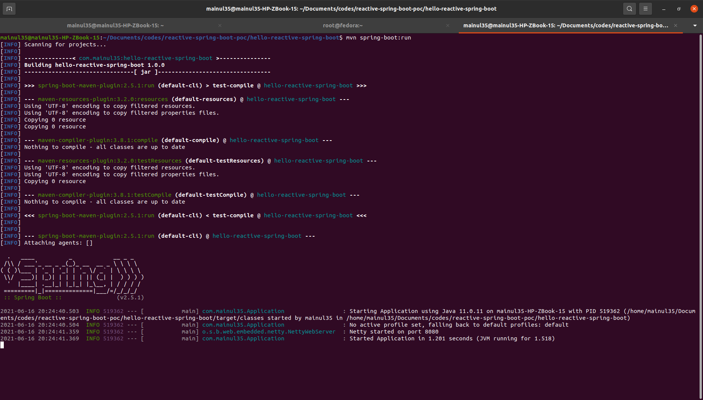

**Note:** The previous article was [hello-reactive-spring-boot](../hello-reactive-spring-boot/). If you are unable to understand something, you can mail me at: [mainuls18@gmail.com](mailto:mainuls18@gmail.com). We will not repeat the same things again and again.

# Configuration
To configure the logging support for spring boot, we have to add the following properties in the application.properties file.

```
logging.level.org.springframework=INFO
logging.level.com.mainul35=ERROR
logging.file.name=logs/application.log
logging.logback.rollingpolicy.max-file-size=10MB
logging.logback.rollingpolicy.file-name-pattern=logs/application-%d{yyyy-MM-dd}.%i.log
logging.pattern.file=%d{yyyy-MMM-dd HH:mm:ss.SSS} %-5level [%thread] %logger{15} - %msg%n
```
- Notice that in above properties, I have set the log level - ``logging.level.com.mainul35`` to ``ERROR`` for my application's package. So only the error logs will be printed in the console as well as file.

- ``logging.file.name`` will be used to define the folder and file name where the logs will be appended

- ``logging.logback.rollingpolicy.max-file-size`` - this defines that the maximum size of a log file will be 10 MB.

- ``logging.logback.rollingpolicy.file-name-pattern`` On the end of each day the log file will be stored as back up file with the provided value / pattern as file name and a new file with the value of ``logging.file.name`` will be created.

- ``logging.pattern.file`` - this property will be used to append the log with the provided pattern value.


# Controller

1. In our ``HelloController`` class, define a Logger object from the ``org.slf4j`` package.

```
Logger LOGGER = LoggerFactory.getLogger(HelloController.class);
```

2. Now in the ``hello()`` method, add some logging output statement.

```	
	@GetMapping({"", "/"})
	public Mono<String> hello() {
		LOGGER.info("======== Printing an INFO Log ========");
		LOGGER.debug("======== Printing an DEBUG Log ========");
		LOGGER.warn("======== Printing an WARNING Log ========");
		LOGGER.error("======== Printing an Error Log ========");
        return Mono.just("Hello world.");
    }
```

Notice that here we have written 4 types of logging statement (info, debug, warn, error). But in out logging file, only the error log will be appended. The reason is because of our configuration in properties file.

# Run Application
If your system has already maven in class path, then open terminal / PowerShell inside your project folder and run the following maven command.

```
mvn spring-boot:run
```


You will see the application running on port 8080. However, if you are not familiar enough with terminal / PowerShell, then you can also run it from your favorite IDE. 


# Try with Postman
If you are excited to test your application, go to postman do a GET request to ``http://localhost:8080/``. If you see the response like the following screenshot, you have successfully created your very first reactive application.


# Logging Output


