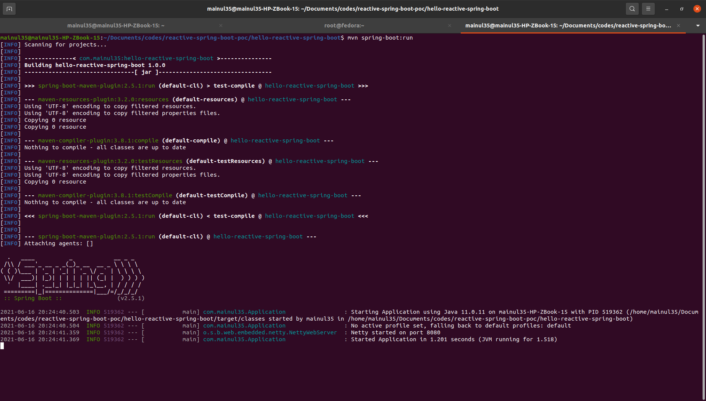
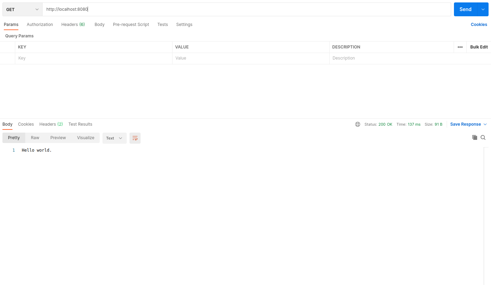
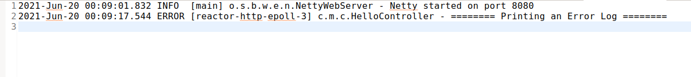

**Note:** The previous article was [configuring logger](../configuring-logger/). If you are unable to understand something, you can mail me at: [mainuls18@gmail.com](mailto:mainuls18@gmail.com). We will not repeat the same things again and again.

# Dependency
We will use ``lombok`` for generating getters, setters, constructors, toString(), hashCode(), equals(), builder and logger object.

```
<dependency>
    <groupId>org.projectlombok</groupId>
    <artifactId>lombok</artifactId>
    <scope>provided</scope>
</dependency>
```
# Controller
We have created a UserController class, which will basically perform all operations related to User. We have also added a ``User`` model class for our use.
Note that, we have created ``GET, POST, PUT, DELETE`` methods.
```
@RestController
@RequestMapping("/users")
public class UserController {
	
	List<User> users = new ArrayList<>();
	
	public UserController() {
		// TODO Auto-generated constructor stub
		
		users.add(User.builder()
		        .uuid(UUID.randomUUID().toString())
		        .username("mainul35")
		        .password("test")
		        .email("mainuls18@gmail.com")
		        .build());
		
		users.add(User.builder()
		        .uuid(UUID.randomUUID().toString())
		        .username("mainul36")
		        .password("test")
		        .email("mainuls19@gmail.com")
		        .build());
	}
	
    @GetMapping
    public Flux<User> findAll() {
        return Mono.just(users).flatMapMany(Flux::fromIterable);
    }

    @GetMapping("/{username}")
    public Mono<User> findByUsername(@PathVariable("username") final String username) {
		var userOptional = users.stream().filter(user1 -> user1.getUsername().equals(username)).findAny();

		return userOptional.map(Mono::just).orElseGet(Mono::empty);
	}
    
    @PostMapping
    public Mono<User> create(@RequestBody final User user){
		user.setUuid(UUID.randomUUID().toString());
		users.add(user);
    	return Mono.just(user);
    }
    
    @PutMapping("/{id}")
    public Mono<User> update(@PathVariable("id") final String id, @RequestBody final User user){
		var user1 = users.stream().filter(u -> u.getUuid().equals(id)).map(u -> {
			BeanUtils.copyProperties(user, u);
			return u;
		}).findFirst().get();
    	return Mono.just(user1);
    }

    @DeleteMapping("/{id}")
    public Mono<Void> deleteById(@PathVariable("id") final String id) {
		users.removeIf(u -> u.getUuid().equals(id));
    	return Mono.empty();
    }

    @GetMapping("/me")
    public Mono<User> getUser() {
    	return Mono.just(users.get(0));
    }
}
```

# Model
Our User model class is defined in the ``model`` package.
```
@Data
@Builder
public class User implements Serializable {
	private String uuid;
	private String username;
	private String email;
	private String password;
}
```
Note that we have used ``@Data`` and ``@Builder`` annotations from Lombok.

# Run Application
If your system has already maven in class path, then open terminal / PowerShell inside your project folder and run the following maven command.

```
mvn spring-boot:run
```


You will see the application running on port 8080. However, if you are not familiar enough with terminal / PowerShell, then you can also run it from your favorite IDE. 


# Try with Postman
If you are excited to test your application, go to postman do a GET request to ``http://localhost:8080/``. If you see the response like the following screenshot, you have successfully created your very first reactive application.


# Logging Output


