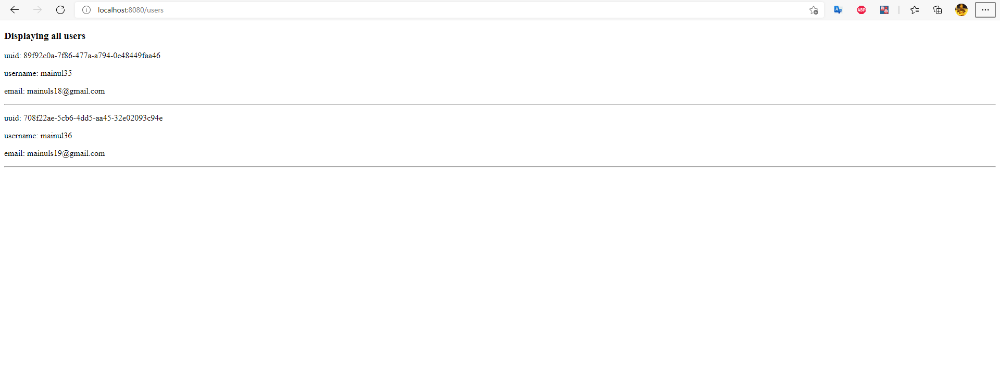

**Note:** The previous article was [more-about-reactive-controllers](../more-about-reactive-controllers/). 
If you are unable to understand something, you can mail me at: [mainuls18@gmail.com](mailto:mainuls18@gmail.com). 
We will not repeat the same things again and again.

# Dependency
We will use ``spring-boot-starter-thymeleaf`` to enable templating support.

```
<dependency>
    <groupId>org.springframework.boot</groupId>
    <artifactId>spring-boot-starter-thymeleaf</artifactId>
</dependency>
```
# Controller
We have changed the codes of our existing controller classes to support mvc.

* Notice that we have replaced the ``@RestController`` annotation with ``@Controller`` annotation.
* We have changed the return type of the ``findAll`` method to ``Mono<String>``
* We have injected an instance of ``org.springframework.ui.Model`` as parameter
* We have added the flux of users as modelAttribute
```
@Controller
@RequestMapping("/users")
public class UserController {
	
	List<User> users = new ArrayList<>();
	
	public UserController() {
		// TODO Auto-generated constructor stub
		
		users.add(User.builder()
		        .uuid(UUID.randomUUID().toString())
		        .username("mainul35")
		        .password("test")
		        .email("mainuls18@gmail.com")
		        .build());
		
		users.add(User.builder()
		        .uuid(UUID.randomUUID().toString())
		        .username("mainul36")
		        .password("test")
		        .email("mainuls19@gmail.com")
		        .build());
	}
	
    @GetMapping
    public Mono<String> findAll(final Model model) {
        var usersFlux = Mono.just(users).flatMapMany(Flux::fromIterable);
		model.addAttribute("users", usersFlux);
		return Mono.just("users");
    }
}
```

We have also done the similar things for our ``HelloController`` class.

# View Page
In ``resources`` folder we have created ``static`` folder. We have created ``hello`` and ``users`` html templates there.

Let's see what's inside ``users.html`` page.

```
<!DOCTYPE html>
<html lang="en" xmlns:th="http://www.thymeleaf.org">
<head>
    <meta charset="UTF-8">
    <title>Title</title>
</head>
<body>
<h3>Displaying all users</h3>
<div th:each="user: ${users}">
    <p>uuid: <span th:text="${user.uuid}"></span></p>
    <p>username: <span th:text="${user.username}"></span></p>
    <p>email: <span th:text="${user.email}"></span></p>
    <hr>
</div>
</body>
</html>
```

Here we have done the following notable things:

* Added ``xmlns:th="http://www.thymeleaf.org"`` namespace with the html tag.
* Used the ``th:each`` to iterate over the flux. It will iterate over the flux.

# Run Application
If your system has already maven in class path, then open terminal / PowerShell inside your project folder and run the following maven command.

```
mvn spring-boot:run
```


You will see the application running on port 8080. 
However, if you are not familiar enough with terminal / PowerShell, then you can also run it from your favorite IDE. 


# View output
Go to your favorite browser and hit ``http://localhost:8080/users``
### All users:
